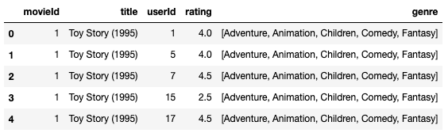
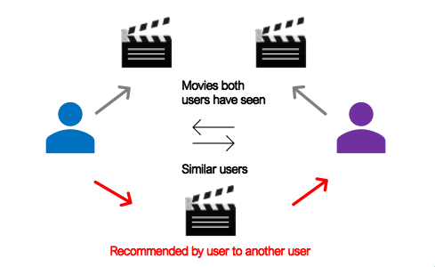
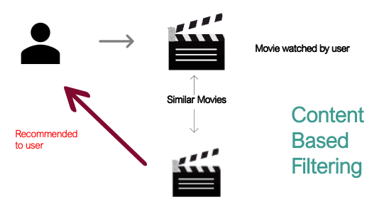

# Recommendation System for Movies

**Author**: Alec Hing

## Project Overview

Using a dataset from MovieLens, a movie recommendation system was created that recommends to users which movies they will like. The system also goes a step further to solve the cold start problem, which is when there is a new user in the dataset and there is no prior information on them. This system also finds a solution to this.

## The Data

As mentioned above the datasets used are from [MovieLens](https://grouplens.org/datasets/movielens/latest/). The two specifically used are called: 'movies.csv' and 'ratings.csv' which are found in the data folder.

The following features were used in this data analysis:
* 'movieId'
* 'title'
* 'genre'
* 'userId'
* 'rating'

### Movie Dataset



## Approach

Some of the most important information that needed to be investigated:
* What users rated and what they didn’t
* How many movies and users are there in this data
* What was the lowest & highest ratings movies got
* What movies received the most ratings

2 systems will be used to create a proper recommendation system:
* First – Collaborative Filtering: Users with similar interests will probably like the same thing
* Second - Content based filtering: If a user likes an item, they may like similar items

### Collaborative Filtering



### Content Based Filtering



## Results

Out of the 6 methods used, the most accurate one was KNNBaseline. This is a more advanced model than the rest that accounts for other variables like bias and the cost function.Its accuracy was calculated to be about 0.55 off while the rest were around 0.80 (RMSE).

## Recommendations

Take into consideration how big the dataset is too; the method used will vary depending on the size. Bigger datasets require more compute time and power. Users tend to watch movies that people with similar likes also enjoy. Finding out from the start what the user prefers is a good start to provide better recommendations as well. Last, take into account how many views & ratings a movie has; this will give a better idea if a particular movie is well liked by someone or a group of people.

### Compute Time


## Conclusion

The movies with the most ratings tended to also be some of the most popular. Just because a movie got a 5.0 does not mean everyone thinks that. The amount of ratings per movie counts too. Multiple people who feel a certain way about a movie show the truth. Finally, new users need to give a baseline of where their interests are to make appropriate recommendations. This is how the cold start problem is solved.


## For More Information

For any additional questions, please contact **Alec @ ahing619@gmail.com**
Full analysis of this project is in a [Jupyter notebook](./Recommendation_system.ipynb) or in the [presentation](./Phase4_Presentation.pdf)

## Repository Structure

```
├── data                                <- Sourced externally 
├── images                              <- Created manually 
├── Recommendation_system.ipynb         <- Analysis in of this project in Jupyter notebook
├── Phase4_Presentation.pdf             <- Non- Technical PDF version of project presentation
└── README.md                           <- Overview of what this project entails and its results
 


